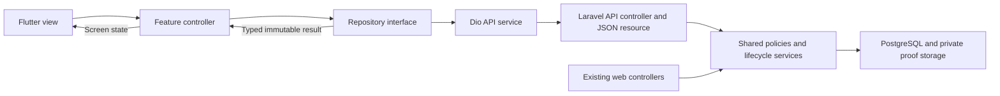

# Flutter architecture and data ownership

## Structure choice

Use feature-based folders with a small MVVM-style separation: views render
state, Riverpod controllers handle presentation/actions, repositories expose
typed data, and API services perform transport. Riverpod also wires dependencies.
The backend remains the authority for operational business rules.

This adapts Flutter's recommendations for separated UI/data layers,
repositories, immutable models, and optional domain logic. A separate use-case
class for every read/button would add work without helping this small app.
[Flutter architecture recommendations](https://docs.flutter.dev/app-architecture/recommendations)
support the general separation; Riverpod and the exact folders are project choices.



## Proposed folder layout

This tree describes the target. The auth preview currently uses `lib/main.dart`,
`app/theme.dart`, `core/ui/brand_logo.dart` and `features/auth/presentation/`.
It has no transport, repository or auth controller; its local widget state handles
only design-preview interactions. See [AUTH_PREVIEW.md](AUTH_PREVIEW.md).
Create folders when a feature needs them instead of filling empty scaffolds.

```text
lib/
  main.dart
  app/
    app.dart
    router.dart
    config.dart
    theme.dart
  core/
    network/             Dio setup, API failure mapping, request IDs
    security/            Token store interface and native implementation
    platform/            Scanner, proof picker, directions adapters
    ui/                  Shared controls and accessibility helpers
  features/
    auth/
      data/              Auth repository, API service, DTOs
      presentation/      Auth controller, sign-in, holding views
    tasks/
      data/              Task repository, query/command DTOs
      presentation/      Queue/detail controllers and views
    trips/
    messages/
    notifications/
    profile/
    cash/                Only after backend ledger readiness
test/
  fixtures/              Synthetic, sanitized API examples
  ...                    Mirrors tested features/responsibilities
integration_test/        Real-device end-to-end checks when added
```

## Responsibilities

| Layer | Owns | Must not own |
|---|---|---|
| View | Layout, labels, focus, local text/file selection, rendering typed state | HTTP, token handling, status transitions, guessed balances |
| Controller | Loading/error/action state, draft validation hints, one pending action, refresh/reconciliation | Authoritative approval, capacity, prices, custody, timestamps |
| Repository | Typed queries/commands, mapping to models, memory cache, invalidation, fixture replacement in tests | Cross-tenant authority or duplicate backend lifecycle rules |
| API service | Paths/headers, serialization, cancellation, multipart upload, error decoding | Widgets, navigation, global UI messages |
| Native adapters | Camera/picker, secure store, safe external navigation, platform failure mapping | Simulated success in a production operation |
| Laravel adapter | Auth, input validation, policy calls, scoped JSON resources | A second independent order state machine |
| Shared backend services | Transactions, locks, eligibility, evidence, immutable event/cash records | Decisions based on client flags or browser-only access checks |

Keep small immutable transport models close to their feature. Introduce distinct
domain models when transport shape would leak across views. Repository interfaces
allow fake transport without launching the web project for a layout test.

## One command, end to end

1. The view displays a task/capability returned by the server.
2. A controller captures the explicit action and required input; it creates one
   idempotency key and retains it until that intent is resolved.
3. The repository delegates a typed command to the API service; unrelated views
   never set an order status directly.
4. Laravel authenticates, scopes, validates, locks, calls its existing service,
   records evidence, commits, and returns the authoritative result.
5. The repository updates/invalidates relevant task, queue, trip, cash and
   notification state. The controller shows confirmed success.
6. On a lost response, reconcile the original command; on conflict, refresh and
   show the permitted next action. Never convert uncertainty into local success.

Disable repeat taps for the same action. Backend idempotency still protects
duplicate requests across navigation, reconnection, or process recreation.
Do not automatically retry POSTs with a newly generated key.

## State and cache lifecycle

Screen state explicitly distinguishes initial loading, returned empty data,
fresh data, refreshing previous data, failure, pending mutation, unconfirmed
result, and server-confirmed success. Avoid several booleans that can contradict.

Use scoped, disposable Riverpod state. Cancel requests and stop polls when views
or sessions close. Preserve task selection by stable ID/phase across refresh,
then fall back to the first still-visible returned task without reordering it.
Invalidate stale drafts when phase/assignment changes.

Begin with memory-only private data. Clear it on logout, account change, token
expiry, or loss of ordinary authorization. Off duty keeps assigned work available;
suspension replaces it with only explicit recovery data. Avoid disk caches of
proof, KYC, phone numbers, buyer addresses, or conversation history.

Refresh capabilities and the selected task on app resume, after a custody
mutation, and when returning from the camera/external navigation. An offline
indicator is a hint; a real request determines availability. Do not add a
connectivity plugin just to declare a server reachable.

Initial proposed foreground polling: one task refresh every 30 seconds while
the active Tasks view is visible; selected messages every 10 seconds while open;
notifications every 60 seconds. Coalesce simultaneous requests, cancel on
background/logout, use jitter/backoff on failures, respect `Retry-After`, and
measure server/device load before tightening intervals. These are starting
budgets, not a guaranteed realtime service.

## Authentication, routing, and environments

The router has sign-in, holding, restricted recovery, and an authenticated shell.
A route guard improves navigation but cannot authorize a backend command.
Notification/deep-link destinations re-fetch and check scope before showing data;
expired/foreign links cannot reveal cached detail or dispatch an action.

Pass public environment values such as API origin and build label through
`--dart-define`. Validate HTTPS for release, reject missing production origins,
and never embed a password, service key, access token, or signing secret there.
Define development, staging, and production explicitly; disable fixtures and
Device Preview in release. A debug fake configuration is clearly labelled.

Store native tokens through a small `TokenStore` interface. Linux needs an
available keyring; report storage failure rather than fall back to plaintext.
For unconfigured Linux test previews, a declared ephemeral test store may be
used with synthetic accounts and explicit re-login. Browser previews need a
separate auth strategy; see [api/CONTRACT.md](api/CONTRACT.md).

## Network and privacy boundaries

Use one configured client per authenticated session. Send tokens only to the
allowlisted first-party API origin; never attach them to map tiles, browser
links, or external redirects. Auth endpoints are separate from authenticated
calls. Sanitize logs to route template, status, duration, and correlation ID.
Do not print bodies, Authorization headers, raw scan/proof/KYC data, or contacts.

Show authorized addresses outside a lazily created map; release camera/map
resources when leaving the view. External directions require an explicit tap
and a validated destination/scheme. Missing maps never hide the operational stop.

If public OpenStreetMap tiles are selected, use a separate unauthenticated tile
client with identifying User-Agent, visible attribution and provider-compliant
HTTP caching. No bulk/offline prefetch or default no-cache headers. Keep private
addresses/contacts out of tile requests and do not add geocoding by assumption.
These requirements follow the [tile policy](https://operations.osmfoundation.org/policies/tiles/);
provider selection/configuration remains an open implementation decision.

## Testing seams

Test meaningful behavior through repository fakes and realistic contract fixtures:
expiry clears state, conflict changes the action, a late response cannot populate
a different account, stale phase rejects a message draft, and double submit
retains one idempotency key. Test sensitive DTO allowlists and integer-money
display separately. Exercise hardware and process recreation on Android.

Keep fixtures out of production dependency wiring. Architecture tests cannot
replace backend authorization, PostgreSQL concurrency, or cross-role custody
acceptance. The full matrix is in
[VERIFICATION_AND_READINESS.md](VERIFICATION_AND_READINESS.md).
