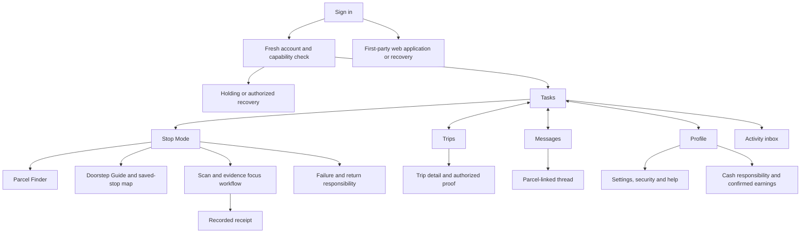
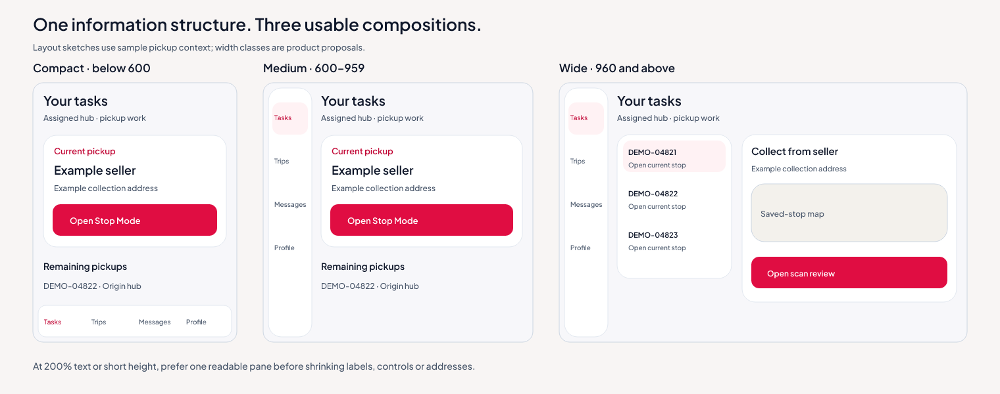
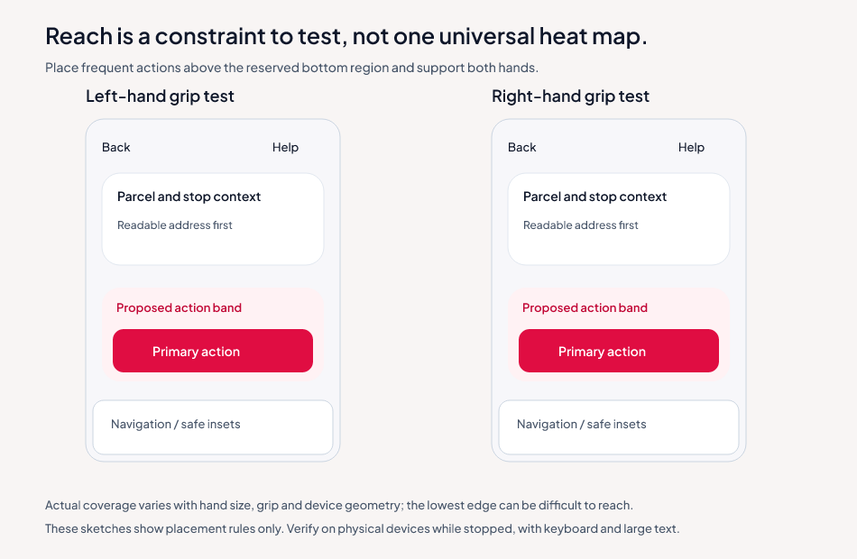

# Rider frontend design specification

Reviewed **October 9, 2026**. This is the target appearance and interaction system
for the Rider app. The account flow and compact Settings hierarchy are already
implemented; the wider counted page catalogue remains planning coverage.
This revision changes design documentation and illustrative assets only. The
current runtime theme retains its previously implemented colors and shapes until
a separately requested implementation slice adopts the new tokens.

## Design direction

Use a **modern mobile work interface** with an independent visual identity:
quiet neutral canvas, opaque white inset groups, smoothly rounded surfaces,
crisp dark typography, precise alignment, minimal chrome and restrained red
emphasis. The result should feel composed, tactile and easy to scan on a phone.
Polish comes from hierarchy, useful spacing and feedback rather than decorative
noise, heavy gradients or repeated explanation.

Primary red stays **`#E00D42`**. Use it for a meaningful primary action and active
selection; use `#C20836` for smaller accent text. The target canvas becomes
**`#F7F7FA`**, with `#FFFFFF` reading/form surfaces and Plus Jakarta Sans retained.
Shapes become component-specific: **20-unit surfaces/groups, 12-unit controls,
16-unit maps, 24-unit dialogs and 28-unit sheets**. Avatars and compact selection
marks can remain circular/pill-shaped. The design system and `tokens.json`
provide the canonical measurements.

The mobile app shares the website's business meanings, data, branding and
permissions. It owns its own presentation: do not copy portal CSS, desktop
panels, uniform corner geometry, breakpoints or long information stacks.
Website source remains the authority for approval, assignment, custody and cash;
its visual style is not the mobile layout specification.

Keep all design prose, example UI and artwork vendor-neutral. Describe the
native mobile patterns and behavior directly, without naming a reference handset
or claiming compatibility with a proprietary visual material. Verified source
URLs can remain in the neutral source register for research traceability.

The selected experience stays **Stop Mode + Parcel Finder + Doorstep Guide**.
The rider must see the current responsibility, authorized stop and clear action
before decoration. Group everyday choices into short labelled rows. Reveal
account/vehicle records, identity guidance and operation-specific fields only
when needed; this does not hide essential task or safety information.

Navigation chrome may use subtle tonal separation or bounded translucency only
where contrast, performance and reduced-effects preferences support it. Proof,
addresses, amounts, fields and task content stay opaque. Every enhanced material
has a readable flat fallback. The reasoning is documented in
[RESEARCH_AND_RATIONALE.md](design/RESEARCH_AND_RATIONALE.md).

## Mobile composition rules

- Use a compact, legible header and one clear page title. Avoid repeating the
  same brand, identity, status and explanation in several panels on one screen.
- Prefer white inset list groups with thin neutral separators, labelled icons,
  complete-row targets and consistent disclosure indicators. Groups share a
  relationship; cards are reserved for a bounded task or selected responsibility.
- Put common actions within the first normal-size phone viewport. Longer managed
  records open through named rows. Preserve full readable values and vertical
  reflow at large text instead of shrinking labels or hiding controls.
- A short form starts with the editable fields and its action. Password, code and
  other sensitive inputs appear only for the chosen operation. Rare guidance can
  expand in place; avoid an extra page containing only one navigation button.
- Keep the four labelled destinations stable. A restrained rounded selection
  shape and small accent are enough; navigation is distinct from content and
  never covers the main action, keyboard, system gesture area or focused field.
- Sheets use a clear title, explicit dismissal and visible intent, with a soft
  upper contour. Use finite transitions that preserve origin and focus; provide
  reduced-motion and opaque fallbacks. Do not add blur or animation to evidence
  that must remain readable.
- Use shape, hierarchy and whitespace for polish while preserving 48-unit touch
  targets, 56-unit grouped rows, labelled feedback and the actual server state.

## Read the design in this order

| Document | What it answers |
|---|---|
| [DESIGN_SYSTEM.md](design/DESIGN_SYSTEM.md) | Color meaning, measured contrast, type, spacing, cards, borders, controls and motion |
| [SCREEN_INVENTORY.md](design/SCREEN_INVENTORY.md) | Exact theoretical counts, every view/overlay/state and coverage |
| [PAGE_BLUEPRINTS.md](design/PAGE_BLUEPRINTS.md) | Composition, navigation, button placement, color/borders, responsiveness and recovery for every page |
| [RESEARCH_AND_RATIONALE.md](design/RESEARCH_AND_RATIONALE.md) | Jakob, Hick, Fitts, von Restorff, grouping, memory and thumb-reach application with limits |
| [IMPROVED_DESIGN_BRIEF.md](design/IMPROVED_DESIGN_BRIEF.md) | Review requirements for the mobile visual direction and honest implementation status |
| [Storyboard](design/visuals/storyboard.png) | Eight illustrative visual compositions with sample values |
| [SOURCE_REGISTER.md](design/SOURCE_REGISTER.md) | Dated evidence and original references |

## Theoretical page count

The counted design has **48 native full views**, comprising **38 baseline**,
**3 selected**, **2 conditional** and **5 optional** views. It also includes
**8 first-party web entry views/panels**, **20 app overlays**, **3 device-owned
surfaces**, **15 shared states** and **8 Stop Mode stage variants**.

All 40 earlier ideas have a mapping. Twelve unselected future concepts are
specified separately: five full views, five sheets and two components. Choosing
every future full view would expand the theoretical native pool to **53**.
That is a coverage calculation, not a promise to implement 53 routes.

A full-screen form step counts as a designed view even if implementation uses
one route for several steps. A filter change, empty result or pickup/delivery
variant does not automatically become another page. This prevents inflated
counts and still records every user-visible situation. The
[inventory](design/SCREEN_INVENTORY.md) is canonical for these distinctions.

## Information architecture

Primary destinations stay **Tasks, Trips, Messages, Profile**, in that order.
Home is the Tasks overview; it is not an extra fifth tab. Settings is under
Profile. Activity opens from a labelled bell/entry; cash and earnings open
through Profile or their relevant records when supported.

Tabs are destinations, not actions. Duty, Scan, Record delivery and Sign out
never become tabs. Tab order and labels stay stable through empty/error states.
Holding screens do not expose operational navigation without permission.

Read/detail pages retain their parent tab selection. Back restores the actual
origin, selection and scroll. Camera, proof forms and other temporary focus
flows may cover navigation as a full-screen modal workflow, then restore it.
This is a deliberate focus presentation, not randomly disappearing tabs.
The conversation composer must sit above the keyboard with a visible return
to its list.

## Responsive layout proposal

Use **available layout width and height**, not the device model or orientation
name. These thresholds are product proposals, informed by current adaptive
guidance; they are not universal standards or copied web breakpoints.

| Available native width | Navigation and composition |
|---|---|
| 320–599 logical units | Four labelled bottom destinations; one-column task/read/form layout; 16-unit page margins |
| 600–959 | 80-unit navigation rail when usable; a centered single work/reading column; 24-unit margins |
| 960 and above | Rail plus a 300-unit master list and at least 420-unit detail area where meaningful; 24-unit gap; cap overall content width |
| Short height or 200% text | Prefer one readable pane; collapse decorative headers and map area before shrinking type or touch targets |
| Folded/split window | Recompute from actual safe available bounds; no essential control across a hinge or cutout |

The wide pairing needs room for rail, margins, gap, list and detail:
80 + 48 + 24 + 300 + 420 = **872 units**. The 960 threshold gives additional
space and avoids a cramped two-pane form. This is a design choice to verify
on target devices. The existing web portal's 1280px desktop shell is a
separate implementation; this document does not restyle that project.

Keep forms at 560 units maximum and long reading around 680. Keep address and
amount relationships intact at large text. At 320, wrap chips, stack secondary
actions and use full-width primary actions. Horizontal scrolling is for the
map/image content when appropriate, not required form or task controls.

## Thumb reach, action placement and keyboard

Place the frequent primary task action in a lower shelf **above** navigation
and safe-area/gesture insets. A bottom bar is not automatically reachable for
every thumb: hand size, grip, device width and the lowermost edge all matter.

Use 48-unit minimum standalone targets, 52-unit primary actions and 8-unit
minimum separation as the Rider field-use proposal. Keep full-width actions
symmetric so they work for both hands. Back/help retains a familiar top location
and a large target; common task actions should not require repeatedly reaching
the far top corner.

Choose one bottom arrangement per view. Measure the actual action shelf,
navigation and keyboard insets; reserve their complete combined footprint in
scrollable content. Do not stack a floating button, tab bar, sheet and keyboard
over the same controls. Modal forms keep their action reachable without hiding
the focused field. Test both hands and a two-handed grip while stopped.

## How Home should look

Top to bottom: compact identity/hub/duty → Your tasks → phase filters →
prominent current/continuing task → remaining queue → small recorded activity.
The current task gets a white softly rounded surface with stage, destination, parcel
identity and one Open Stop Mode action. Less urgent rows stay unboxed with
clear spacing/dividers. Operational counts appear once where useful.

The canvas supplies warmth. Crimson marks the real primary action and active
navigation/filter; dark text makes the stop/address readable. A sand inset
explains waiting for another actor. Do not fill all cards with status colors.
A bounded map appears in Stop Mode or its expanded saved-stop view; it should
not displace the work queue on an empty or short Home screen.

The detailed composition and each alternative state are
[P05](design/PAGE_BLUEPRINTS.md#p05). Every other page receives the same level
of structure in the blueprints.

## Selected feature compositions

| Experience | Visual structure and reason |
|---|---|
| Stop Mode | Stage/parcel → full destination → instruction excerpt → bounded map → parcel position/cash → next action. Group related facts; one action attracts attention. |
| Parcel Finder | Owned parcel list → small labelled bag diagram → selected slot → Set/Clear. The diagram supports recognition and stays supplementary to identity/scanning. |
| Doorstep Guide | Original destination → entrance/landmark → unit/access details → directions/contact fallback. Plain readable sections beat decorative cards around each sentence. |

The saved pin is stationary and labelled. Moving rider dots, optimized lines,
travel times and arrival promises require their own accepted services.
Tile failure preserves the address and actions. Zoom/Show stop controls have
large labelled touch targets and opaque backplates. Attribution stays visible.

## Visual decisions that should be consistent

- Use filled crimson for one meaningful primary action, light rose for selection,
  sand for relevant waiting and mint for a recorded result. Pair every state
  color with text/icon.
- Use borderless information groups when spacing, headings and dividers are
  enough. Use visible control outlines for inputs, choices and neutral buttons.
  Read-only managed values are definition rows, not disabled-looking inputs.
- A task card can use a subtle shadow/outline because its nested explicit action
  is discoverable. A fully clickable row needs text/chevron, focus and semantics.
  A shadow alone does not identify a control.
- Align labels and values predictably; use one typeface and a compact type scale.
  Cash amounts use aligned numerals, not a separate decorative font.
- Use small original vector motifs only in empty/intro/profile contexts.
  Camera, proof, address and financial information get functional emphasis.
- Motion explains selection, sheet placement or accepted feedback. It is finite,
  lightweight and removed/reduced under the device preference.

The exact tokens, combinations and border decision table are in the design
system. Each blueprint gives its own color/border reason.

## Visual layout studies

These are editable documentation sketches, not rendered layout/device checks.
They illustrate content-driven adaptation and inset-aware action placement.

## Operational meanings the design must preserve

Seller pickups are rider-claimed; final-mile delivery is hub-assigned.
An assignment is not a physical handoff. The current web model supports up
to five active pickups and disallows a new final-mile assignment while other
active courier work remains. Design does not turn that into a multi-parcel
final-mile run or universal exact-barangay assignment.

Use the current stage's authorized stop. Origin-hub intake, failed return receipt
and reconciliation belong to their actual actors. Delivery receipt is different
from buyer completion and cash remittance. Missing ledger data is unavailable,
not zero. An illustration, code lookup or photo selection is not proof.

The [operational flow](RIDER_FLOW.md) and
[selected feature plan](FEATURE_DIRECTION.md) remain the source for actions.
This design does not add a new operational endpoint or change custody.

## What the original request was missing

The improved brief explicitly covers navigation restoration, recovery states,
keyboard and safe areas, large text, both-handed use, low light/sunlight,
map-data honesty, private evidence, unknown permissions, empty history,
actual amount meaning, translation, optional-scope labels, motion reduction,
design-to-code tokens and a meaningful usability review.

## Validation before calling the design successful

Use documentation checks now and actual prototype/device checks during the
selected implementation task. Suggested review tasks: claim a pickup, find a
tagged parcel, understand hub waiting, inspect entrance instructions, record
a handoff, recover a rejected photo, handle a failed delivery, read a message
with the keyboard and distinguish cash held from earnings.

Measure completion/error/recovery and observe reach; do not assert time savings
or universal superiority from a law name or an attractive picture. Verify at
320/360/390/430 units, tablet/wide bounds, landscape short height, 200% text,
keyboard open, screen reader, reduced motion and adverse network states.

All 16 major areas and earlier 40 ideas have documented mappings. Current
source reads, calculated contrast and static illustrations establish a
reviewable specification, not native usability, deployed APIs or release
readiness. Implementation estimates and the November freeze remain separate.
