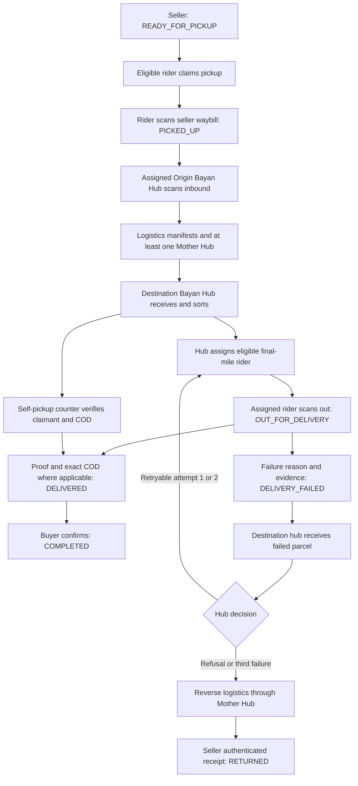

# Rider operational flow

This is the intended mobile behavior under the web contracts, not a claim that
the Flutter starter or all backend exception paths implement it. Endpoint names
are proposed in [api/CONTRACT.md](api/CONTRACT.md).

## Eligibility and entry

1. Sign in to an existing courier account. The role is fixed at registration.
2. Fetch fresh account capabilities. Platform KYC approval, active account,
   eligible company/hub placement, barangay scope, and duty are separate gates.
3. Pending/rejected applicants see their own holding/resubmission guidance.
   Approval alone does not place a courier or reverse a suspension.
4. Eligible on-duty couriers may claim/receive new work up to server capacity.
   Multiple pickups are allowed; each parcel has one pickup custodian.
5. Going off duty stops new work while preserving existing assigned work.
   Suspension blocks ordinary access and triggers narrowly authorized recovery.

Adult-worker and evidence requirements remain backend-owned: courier identity,
real birthday proving age 18+, license, vehicle registration/ownership evidence,
and reviewed platform approval. The app cannot send its own approval or age.
An unknown eligibility response fails closed for new work and offers refresh.

## The custody path



The self-pickup branch replaces final-mile delivery only after destination intake.
Same-region transport still uses a Mother Hub; cross-region transport uses the
required origin and destination Mother-Hub checkpoints. Riders do not perform
manifest, facility-handler, or counter actions in this app.

## Stage, next stop, action, and completion evidence

| Rider stage | Relevant stop | Permitted interaction | Evidence that ends this stage |
|---|---|---|---|
| Available pickup | Authorized seller preview | Claim if currently eligible and below capacity | Server atomically creates/returns the rider's assignment |
| Claimed, awaiting collection | Seller | Scan matching waybill and confirm handoff | Server records parcel/actor/source state/custody and checkpoint |
| Collected, awaiting origin intake | Assigned Origin Bayan Hub | Directions, contact, view handoff instruction | Expected hub's authenticated inbound scan; rider cannot self-confirm intake |
| Assigned final mile, awaiting departure | Destination Bayan Hub | Scan the assigned parcel out | Server verifies assignment, hub, waybill, source state; records departure |
| Out for delivery | Saved checkout buyer destination | Call/message when permitted; record success or failure | Immutable outcome evidence and server-confirmed event |
| Failed, awaiting hub return | Destination Bayan Hub | Return directions and approved contact/recovery | Destination handler's inbound recovery scan |
| Delivered | Recorded trip | View evidence/history within scope | Buyer confirmation is separate and cannot be triggered by rider |
| Completed or returned | Recorded history | Read-only detail within retained scope | No reopening of terminal operational states |

Client stage labels describe the returned assignment. They are separate from
commercial order status and cannot imply possession from assignment alone.
No generic “Set status” control exists. The backend returns permitted actions
and reasons for unavailable actions; the server rechecks every command.

## Pickup details and recovery

- A claim locks the order and parcel consistently with seller cancellation.
  Two riders racing for one job produce one winner. Refresh a losing claim;
  do not silently claim a different parcel.
- A waybill scan is submitted input and must match the assigned parcel.
  Populating the stored tracking code automatically is not scan evidence.
- Before physical collection, an approved release action may accept an
  allowlisted reason and retain an audit event. Its implementation is a backend
  dependency. After pickup custody, releasing an assignment is prohibited until
  the expected hub records recovery.
- Incorrect/damaged parcels and unexpected hubs use the approved exception
  path without advancing custody. App cancellation only closes a local form.
- Refresh after origin intake. Hide the finished pickup from active work only
  when the authoritative server result confirms responsibility ended.

## Delivery evidence

Require a genuine proof image, recipient name or relationship, server timestamp,
and exact COD collection when applicable. Coordinates/signature may support
evidence if later approved; they do not replace required proof. The app previews
the selected file and preserves safe input after a rejected submission.

Selecting a photo, tapping submit, or timing out never proves delivery. A lost
response enters “Result unconfirmed”: refresh/reconcile the command before
retrying with the same idempotency key. Successful retries return the original
event, without duplicate files, cash records, or checkpoints.

Recipient, city/province, destination hub, and COD snapshot are immutable after
dispatch. Approved clarifications may add a landmark inside the existing service
area; they cannot reroute the order through a rider edit.

## Failure reasons and attempt ownership

| Baseline reason | Next authorized behavior |
|---|---|
| Customer unreachable | Return to hub; review before retry |
| Customer unavailable/requested reschedule | Hub return and approved retry date |
| Incorrect/incomplete address | Clarification only inside assigned destination area; hub review |
| Unsafe access/severe weather | Hub review confirms service can resume |
| COD amount unavailable/unusable | Hub review and confirmation of exact payment availability |
| Customer refused parcel | Non-retryable; RTS after destination-hub return |

Reason **codes** must be frozen with the backend; these are normative reason
labels, not invented API enum values. Fetch code/label/evidence requirements
from capabilities. Submit useful notes and any required proof. The server
increments the attempt number and records the timestamp and event location
context; no live GPS permission is required by this plan.

Failure does not end custody immediately. The parcel remains this rider's
responsibility until the destination hub receives it. Retryable attempts one and
two can resume only after that intake and hub approval. The third failed attempt
starts reverse logistics. A rider cannot select a retry date, bypass hub return,
erase attempts, or mark `RETURNED`; seller receipt closes the reverse journey.

## COD and earnings

```text
Exact amount due -> cash held by collecting final-mile rider
-> remittance received at destination hub -> platform reconciliation
-> seller settlement eligible only when the buyer has also COMPLETED
```

- The server's order-total snapshot is the amount due. Partial payment is not
  accepted. Larger tender is acceptable only with correct change before handoff;
  the ledger records the amount due, not the tendered amount.
- Collection, remittance, discrepancy, reconciliation, and earnings are
  distinct records/states. Rider acknowledgement alone cannot prove hub receipt.
- Show confirmed balances only when a ledger API exists; otherwise state that
  the feature is unavailable. An empty ledger is different from a missing API.
- Append corrections through the authorized review flow. Riders cannot edit or
  delete cash history, mark platform payment, or settle commission.
- The 90% seller / 10% platform split applies to product subtotal only.
  Shipping and final-mile rider earnings are separate. No rate is guessed.

## Restricted and interrupted sessions

Off-duty riders keep current responsibilities visible. A suspended rider sees
only expressly authorized recovery information; the backend must specify its
capability and receiving hub. Recovery does not restore ordinary portal access.
If that endpoint is missing, explain the restriction and approved contact path;
never retain broad access as a workaround.

On session expiry, clear private in-memory queues and token state, require
sign-in, and refetch capabilities. Sign-out does not surrender a parcel or cash.
Returning from camera, navigation, or background refreshes the selected task
before submission. Missing permissions or connectivity retains honest local
draft state but never advances the commercial order.

## Directions, messages, and notifications

Use the stage-specific authorized stop: seller before pickup, origin hub after
pickup, destination hub before final-mile departure or after failure, saved buyer
destination during delivery. Text/address remains visible when maps fail. No
default pin, live rider dot, predicted ETA, or optimization claim is permitted.

Pickup contact is with the authorized seller; final-mile contact is with the
authorized buyer. Sending a stale pickup draft after a phase change must be
rejected, not redirected to a different recipient. Reading a conversation marks
only displayed messages through an explicit boundary as read.

Persistent assignment/reassignment, return, and remittance notifications link
to still-authorized resources. Queue entries can serve as operational rider
notifications; polling only fetches data and cannot replace durable event records.

Sources: [commercial ownership](https://github.com/Auvryy/BagooPH/blob/main/docs/SYSTEM_FLOW_AND_SPECIFICATIONS.md),
[validation and recovery](https://github.com/Auvryy/BagooPH/blob/main/docs/CORE_FLOW_VALIDATION_AND_EDGE_CASES.md),
[physical custody](https://github.com/Auvryy/BagooPH/blob/main/docs/SORTING_CENTER_LOGISTICS_FLOW.md),
and [courier responsibilities](https://github.com/Auvryy/BagooPH/blob/main/docs/COURIER_FLOW.md).
