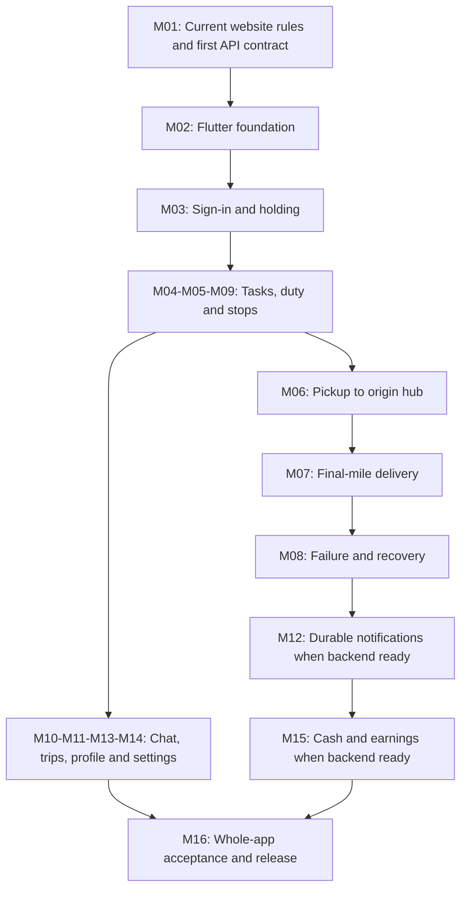

# Rider major tasks and build workflow

This is the feature map for building BagooPH Rider Mobile, reviewed October 5,
2026. It answers **what we need to build, in what order, and what proves each
area works**. The [detailed backlog](SUBTASK_BACKLOG.md) now turns these areas
into **180 planned subtasks and 63 suggested batches** for later prompts.
Creating the planning cards does not create future execution records or
authorize implementing them now.

The current app has a welcome screen and debug Device Preview in
[lib/main.dart](../lib/main.dart). The architecture and authenticated API are
proposals. None of the operational features below is implemented in Flutter;
M02 has only the starter, and M01 has a proposed contract. A completed planning
document does not mean the app or its backend dependencies are complete.

## Always check the Bagoo website project

**You can always reference the Bagoo website project to keep track of its docs,
new features and behavior across buyer, seller, courier, logistics and admin.**
Before every feature branch, read its current docs, roadmap, relevant code and
tests. The website project owns the shared business rules and operational data;
this app consumes the same backend rather than building a separate system.

Start with the [Bagoo documentation map](https://github.com/Auvryy/BagooPH/blob/main/docs/README.md)
and [current backend roadmap](https://github.com/Auvryy/BagooPH/blob/main/docs/CORE_FLOW_ROADMAP.md).
Use [SOURCES.md](SOURCES.md) to find the authoritative rule for each feature,
and [api/INTEGRATION_PLAN.md](api/INTEGRATION_PLAN.md) for coordination. References
may require repository access; use the current authorized checkout when needed.
Observe cross-role behavior in the authorized web environment when testing an
integrated slice, and record the deployed revision. A code merge alone does not
prove that a website deployment or mobile endpoint is available.

For the earlier scoped major-area review, the web checkout and a read-only
remote-main check both
identified `88ed1871e39755ae09ee233112351e42472fda30`. Its roadmap includes the
B04 logistics eligibility work; Phase 0 remains partial. Its API routes still
contain public tracking only, and the inspected app/routes/migrations have no
native token implementation. This dated observation is not a second backend
status list. Re-read the roadmap and executable API before each implementation
slice; later website changes can alter dependencies. The detailed-backlog follow-up
also inspected newer buyer-access work and the later local main revision recorded
in [SOURCES.md](SOURCES.md). Its buyer holding and narrow owned-order receipt rules
are reflected in planned delivery acceptance; deployment remains unverified.

## What “major task” means here

A major area is a product capability, often containing several screens and
several future branches. It is not one giant development task. M01–M16 are
local planning references, not external task IDs, completion claims or separate
account roles. Operational pickup and final-mile work use one `courier` role.

Preserve the shared route: seller → pickup rider → Origin Bayan Hub → at least
one Mother Hub → Destination Bayan Hub → final-mile rider or self-pickup counter
→ buyer. Hub manifests, intake and counter release remain authorized web/hub
actions; the Rider app cannot shortcut this chain or confirm buyer receipt.

The execution milestones R00–R11, proposed dates and capacity assumptions stay
in [DELIVERY_PLAN.md](DELIVERY_PLAN.md). The areas below partition that same
baseline; they do not add sixteen more phases. The detailed estimate is a
**315-hour reforecast**, with a **213–499.5-hour planning range**, superseding
the earlier coarse 130–204 hours rather than adding another budget. Estimate
each requested branch from current evidence. Major areas may span several milestones;
each actual execution task must fit 1–14 inclusive calendar days.

| Area | Major work | Rider outcome | Main dependency | Delivery milestone |
|---|---|---|---|---|
| M01 | Shared API contract and website synchronization | App and website agree on authority, payloads and outcomes | Current web contracts, backend owner and staging access | R01; refreshed in every slice |
| M02 | Flutter foundation and design system | Consistent, accessible app with predictable navigation | M01 initial conventions; device baseline | R02 |
| M03 | Authentication and account holding | Sign in and understand approval, placement or restriction | M01 auth/me API, M02 | R03 |
| M04 | Home and task queues | See current responsibilities and the next useful action | M03; scoped task reads | R04 |
| M05 | Duty and operational eligibility | Control new-work availability without abandoning custody | M03, M04; shared eligibility/duty policy | R04 |
| M06 | Pickup and origin-hub handoff | Claim, collect the correct parcel, and finish at the origin hub | M04, M05; accepted claim/scan/recovery rules | R05 |
| M07 | Final-mile delivery and proof | Collect at the destination hub and record the real outcome | M04, M05, M06 normal-path acceptance; accepted custody/departure/outcome APIs | R06 |
| M08 | Failed delivery, returns and restricted recovery | Keep parcel/cash responsibility clear through exceptions | M07; backend exception/recovery acceptance | R07 |
| M09 | Directions and permitted contact | Reach the authorized stop with usable address fallback | M04; stage-scoped destination/contact data | R04–R07, alongside the relevant flow |
| M10 | Messages and chat | Communicate with the authorized person for this parcel phase | M03, M04; messaging/read-boundary API | R08 |
| M11 | Trips and recorded history | Review scoped recorded journeys without invented metrics | M03, M04; history API | R08 |
| M12 | Notifications | Notice durable assignment, recovery and cash events | M03, M04; backend notification phase | R09 |
| M13 | Rider profile and assignment information | See real identity, review, company/hub and vehicle data | M03; own-profile resource and permitted edits | R08 |
| M14 | Settings, security and help | Manage permitted account actions and leave safely | M03; M13 navigation for full settings; validation/revocation policy | R03 essentials, R08 full slice |
| M15 | COD remittance and earnings visibility | Distinguish cash held, remitted, reconciled and earned | M07, M08; backend financial phase | R09 |
| M16 | Reliability, Android acceptance and release | A reproducible build with verified behavior and clear limits | Every implemented slice; device/staging evidence | Starts R02; final gates R10–R11 |

## Screen map and UX ownership

Use four labelled primary destinations: **Tasks, Trips, Messages, Profile**.
The Home page is the Tasks destination's work overview, not another tab showing
the same queue. Settings belongs under Profile. Notifications opens from the
shell; Cash and earnings can open from Profile when its API is accepted. This
is the proposed native navigation, to validate during the foundation work.

| Surface | Contents | Work owner |
|---|---|---|
| Sign-in and holding | Credentials, recovery/registration links, review and access guidance | M03 |
| Shared shell | Navigation, safe areas, account-aware route guards, one duty header | M02; M03 guards; M05 duty |
| Home / Tasks | Real greeting/scope, queues, selected parcel, stage, next stop, primary action | M04 |
| Pickup detail and scan/review | Claim context, parcel check, collection and origin-hub handoff | M06 |
| Delivery detail, scan/review and outcome | Destination-hub departure, recipient/proof/COD, confirmed result | M07 |
| Failure and recovery detail | Allowed reasons, held responsibility, receiving hub and recorded recovery | M08 |
| Stop directions/contact | Authorized address, explicit directions/call action, launch failure fallback | M09, reused by M06–M08 |
| Conversation list and thread | Parcel/phase context, message history, composer and read boundary | M10 |
| Trip list and detail | Recorded journeys, filters, checkpoints and scoped proof access | M11 |
| Notification list and detail link | Durable own events, read state and fresh resource authorization | M12 |
| Profile and managed details | Identity/review, contact data, company/hub/barangay, vehicle | M13 |
| Settings, security and help | Permitted account edits, password, logout, approved help/about links | M14 |
| Cash and earnings | Authoritative balance categories, remittance evidence, confirmed earnings | M15 |

Shared scanners, proof selection, directions, transport, error mapping and token
storage are reusable adapters under [ARCHITECTURE.md](ARCHITECTURE.md). M06–M08
can be separate work areas inside `features/tasks/`; a major area does not need
its own HTTP client, duplicate state machine or empty folder.

## Complete frontend design coverage

[DESIGN_SPEC.md](DESIGN_SPEC.md) and the
[screen inventory](design/SCREEN_INVENTORY.md) map all 16 major areas and all
40 earlier ideas to planned views/states or explicitly future concepts.
The inventory counts 48 native full views, 8 external entry views/panels and
20 app overlays separately. Page blueprints include navigation, visible hierarchy,
controls, color/borders, theory and responsive/recovery behavior. The existing
180-card baseline and implementation evidence remain separate.

## Selected frontend additions

The user selected **Stop Mode, Parcel Finder and Doorstep Guide** on October 6,
2026. Their [feature direction](FEATURE_DIRECTION.md) defines acceptance and
preserves the rider-claim pickup / hub-assignment final-mile distinction.

| Selected experience | Major ownership | Current planning state |
|---|---|---|
| Stop Mode | M02, M04, M06–M09, M16 | Selected presentation over existing tasks/actions; not implemented |
| Parcel Finder | M04, M06/M07 scanning, M16 cleanup | Selected extension; tag storage and incremental estimate pending |
| Doorstep Guide | M01 task-detail contract, M04, M09, M16 | Selected extension; authorized instruction data and incremental estimate pending |

The 180 cards and 63 batches cover the existing baseline. Do not report the new
extensions complete from that catalog, silently include them in its 315-hour
estimate, or infer multi-parcel final-mile capacity from a queue layout. Break
selected extensions into bounded cards after their data and scope decisions;
requested implementation still checks direct/transitive prerequisites.

## Detailed major work

### M01 — Shared API contract and website synchronization

**Outcome:** one agreed interpretation of each Rider action across app and web.

1. Review the current website rule, roadmap, service, route and tests for the
   requested slice. Check what changed in the other roles since the last review.
2. Agree its minimal JSON, scope, capabilities, evidence limits, errors,
   idempotency and compatibility with the backend owner. Start with token
   sign-in, own account context and task reads; extend one action at a time.
3. Record the accepted contract/version and deployment revision in consumer
   fixtures and branch evidence. Keep proposed endpoints labelled until tested.

**Finish evidence:** each released slice has a tested backend contract and
consumer examples for success and denied/stale/unknown outcomes. Existing
Inertia forms or public tracking are not substitutes for a native API. Backend
changes need their own authorization and owner; this app plan does not edit the
web repository. Use [the API proposal](api/CONTRACT.md) as the starting agreement.

### M02 — Flutter foundation and design system

**Outcome:** a small reusable app shell that makes later feature work consistent.

1. Establish app configuration, theme, navigation and feature/repository
   boundaries. Add proposed packages only when needed and after compatibility
   checks; do not assume they are already installed.
2. Build reusable fields, buttons, status/error panels and accessible sheets.
   Use the Rider accent `#E00D42`, canvas `#FFFAFB`, 8 logical-pixel corners and
   licensed bundled Plus Jakarta Sans when implemented.
3. Wire explicit development fixtures behind replaceable repositories; retain
   debug Linux Device Preview and establish the physical Android baseline.

**Finish evidence:** navigation and representative loading/error layouts work
at 320–430 logical pixels, 200% text and with the keyboard/safe areas. Controls
have labelled 48 logical-pixel touch targets, visible focus and usable contrast.
Fixtures are visibly a development configuration and cannot produce operational
release success. Foundation checks include meaningful routing/widget checks and
Android launch evidence; desktop layout review does not verify native hardware.

### M03 — Authentication and account holding

**Outcome:** riders can enter safely and understand exactly why access is limited.

1. Build sign-in, credential visibility/validation, pending request and useful
   rejected/network responses against the agreed auth contract.
2. Store the native token through the secure adapter, fetch fresh own-account
   capabilities and guard navigation. Handle expiry, revocation and account change.
3. Distinguish pending, rejected, approved but unplaced, inactive/suspended and
   temporarily unavailable responses. Link to approved web registration,
   resubmission and password recovery in the system browser for the first version.

**Finish evidence:** wrong credentials/role, expired/revoked tokens, access
changes and unknown eligibility cannot open operational screens. Platform KYC,
adult-worker eligibility, logistics placement and duty are separate server
decisions. Ordinary suspension access stays closed; only accepted M08 recovery
capabilities are available. Browser sign-in does not become native token auth.
Fully native registration/KYC remains a scope decision, not a hidden requirement.

### M04 — Home and task queues

**Outcome:** the rider knows what they hold, where to go and what they may do next.

1. Build the Home/Tasks overview with actual identity and scope, available
   pickups, active pickups and assigned final-mile work. Show returned counts
   and capacity, with separate explanations for unplaced, empty and failed reads.
2. Add filtering/selection and fresh task detail: identifier, phase/stage,
   authorized address, exact COD when applicable, permitted action and reason
   for any blocked action. Keep server queue order while preserving selection.
3. Refresh after resume and relevant actions. Use bounded foreground reads,
   honest stale state and cancellation on account/view changes.

**Finish evidence:** no foreign company/hub work leaks; removed selections and
unknown stages remain safe. Returned empty data can say “No tasks”; failed reads
cannot. A delivered-today counter is labelled as recorded deliveries, not buyer
completion. Recent activity samples are not lifetime metrics. This area owns
read presentation; M06–M08 own the individual custody commands.

### M05 — Duty and operational eligibility

**Outcome:** a clear, confirmed availability control with custody preserved.

1. Show current server duty and company/hub/barangay placement in the task header;
   explain missing or ineligible placement instead of inventing a default hub.
2. Submit the desired duty boolean, show pending state and prevent repeated taps.
   Refresh eligibility/capacity after confirmation or a conflict.
3. Keep all existing responsibilities reachable off duty and route restrictions
   to their distinct holding or narrowly approved recovery experience.

**Finish evidence:** off duty prevents new claims/assignments but does not lose
held work. Duty cannot grant approval, capacity, placement or unrestricted access.
After a timeout, reconcile the result rather than claiming the switch was saved.
Company, hub, vehicle and reassignment controls stay with their web authorities.

### M06 — Pickup and origin-hub handoff

**Outcome:** the correct ready parcel reaches its assigned origin hub with evidence.

1. Present eligible available work and an explicit atomic claim confirmation.
   Handle a competing claim, stale eligibility and capacity rejection safely.
2. Guide travel to the seller, parcel verification, real matching-waybill scan,
   review and collection confirmation. Use shared scan permission/error states.
3. Change the next stop to the assigned Origin Bayan Hub and wait for its
   authenticated intake. Offer pre-collection release only if an accepted
   reasoned release API exists; after custody, require approved hub recovery.

**Finish evidence:** one rider wins a race; wrong codes/actors/source states do
not advance custody; repeat/lost-response confirmation creates one event. Pickup
ends only with the expected hub's recorded intake. No direct seller-to-buyer
route, self-confirmed hub receipt or automatic stored-code “scan” is allowed.
Stronger waybill/handoff evidence is a backend prerequisite, not a UI-only fix.

### M07 — Final-mile delivery and proof

**Outcome:** the assigned rider records a genuine recipient handoff and exact cash.

1. Load the hub-assigned parcel and verify its matching waybill before confirmed
   departure from the Destination Bayan Hub; refresh the resulting custody state.
   Verify accepted origin/Mother/destination custody in the owning web flow;
   incomplete backend manifest/custody requirements remain dependencies.
2. Guide delivery to the immutable checkout destination. Show exact server COD
   or an explicit no-COD state; missing cash data never defaults to zero.
3. Capture/preview/replace genuine proof, recipient evidence and required cash
   acknowledgement, then submit one intent. Preserve safe drafts on rejection
   and reconcile unconfirmed results before retrying.

**Finish evidence:** wrong assignment/hub/code, bad evidence, storage failure,
double taps, interrupted camera/picker and same-key retries are handled honestly.
Success means server-confirmed `DELIVERED`, not buyer `COMPLETED`, cash remittance
or payout. Proof remains private, scoped and immutable after acceptance. COD
collection evidence belongs to the accepted outcome contract; M15 separately
requires financial ledgers. Expose only backend capabilities whose gates passed.

### M08 — Failed delivery, returns and restricted recovery

**Outcome:** an exception never makes held parcels or cash disappear.

1. Load allowed failure reasons and evidence requirements; collect useful notes
   and show the server's attempt number and resulting return instruction.
2. Keep the destination-hub return visible until the handler records intake.
   Display the hub's retry/RTS decision and later assignment without rider scheduling.
3. Handle restriction during active work through explicit recovery capabilities,
   minimal disclosed data, receiving-hub instructions and confirmed recovery.

**Finish evidence:** retryable attempts one/two need hub receipt and approval;
refusal and third failure follow reverse logistics, with seller receipt closing
`RETURNED`. Reassignment cannot precede recovery. The rider cannot erase attempts,
mark returned or reopen ordinary suspended access. Backend attempt records,
return/retry/RTS and restricted recovery must be accepted first; unsupported
operations show a real limitation and approved contact path.

### M09 — Directions and permitted contact

**Outcome:** the current authorized destination stays usable without a map service.

1. Resolve the relevant stop from task state: seller, origin hub, destination
   hub or saved buyer destination. Show its full usable address as text.
2. Offer explicit external directions and permitted contact actions; validate
   the target and handle unavailable apps, coordinates and addresses truthfully.
3. Preserve an address/copy fallback and refresh the selected stop after phase
   changes. Evaluate an embedded map later only with an approved provider/contract.

**Finish evidence:** missing data never opens a guessed pin/default city; available
work is a preview and cannot disclose full unrelated contact data. Navigation
failure does not block address access or claim success. No live GPS, calculated
ETA, tracking dot, route optimization or new geocoding service enters this slice.

### M10 — Messages and chat

**Outcome:** parcel communication reaches the right authorized person.

1. Build a conversation list and one selected thread on phones, with a clear
   Back action, parcel/phase context, scrolling history and keyboard-safe composer.
2. Send validated plain text to the selected phase-bound thread, retain safe
   drafts on failure and reconcile duplicate/uncertain sends under the contract.
3. Acknowledge only displayed messages through the explicit last-seen boundary;
   refresh permissions when assignment/phase changes or the app resumes.

**Finish evidence:** unopened threads/new arrivals are not marked read; a stale
seller draft cannot reroute to a buyer. Foreign threads and former-phase sends
are denied. Use real stored avatars with initials fallback, pagination and
bounded foreground refresh. This is delivery-linked chat, not an unrestricted
user directory or a new realtime/push service.

### M11 — Trips and recorded history

**Outcome:** the rider can inspect real scoped records and distinguish their meaning.

1. Build list/detail, stable pagination and accepted search/payment/date filters.
   State the returned history's attribution and scope clearly.
2. Show recorded checkpoints, timestamps, outcomes and authorized proof access,
   keeping assignment, custody and commercial status distinct.
3. Format Asia/Manila dates and integer-centavo PHP amounts consistently; handle
   absent fields, unknown states, stale pages and failed next-page requests.

**Finish evidence:** local-midnight boundaries, stable ordering and authorization
pass checks. Existing web Trips is final-mile scoped; do not advertise full pickup
or lifetime history without an accepted supporting resource. A delivered record
does not prove buyer confirmation, remittance or payout. History is read-only;
M15 owns cash balances and confirmed earnings, not inferred totals here.

### M12 — Notifications

**Outcome:** important Rider events remain visible after a missed app session.

1. Agree durable event types, own-recipient scope, stable IDs, pagination and
   unread/read behavior after the backend notification foundation is accepted.
2. Build notification list, explicit read acknowledgement and links that fetch
   fresh authorization before opening a task, recovery detail or cash record.
3. Refresh on resume or bounded foreground polling; handle revoked resources,
   delayed events, duplicate delivery and failed read acknowledgement.

**Finish evidence:** a recorded event appears once for its correct recipient;
read state persists and inaccessible links fail safely. Task queues already
communicate assignments; polling does not create durable notification records.
Do not imitate a missing notification API with invented events, badges or external
order push/SMS/email services.

### M13 — Rider profile and assignment information

**Outcome:** identity and managed placement are accurate and understandable.

1. Show actual account identity/review/contact data, stored avatar or initials,
   company, hub/barangay assignment and managed vehicle/license fields.
2. Separate identity, permitted edit information, assignment and vehicle sections;
   explain absent/unassigned records without fake credentials or placeholder values.
3. Connect only field changes allowed by the accepted server policy and its
   canonical validators. Route reviewed identity/KYC corrections through their
   approval flow, resolving discrepancies with website behavior before exposure.

**Finish evidence:** rejected edits preserve input and display real validation;
success reflects fresh saved data. A rider cannot change role, approval, company,
hub, operational vehicle placement or restrictions. Private evidence stays behind
its own authorization, not public URLs in general profile JSON. M14 owns security
actions so account forms and session behavior are not duplicated.

### M14 — Settings, security and help

**Outcome:** useful account controls that respect review and custody responsibilities.

1. Build Profile-to-Settings navigation, permitted contact/account preferences
   only where supported, password change and explicit sign-out.
2. Apply current-password/email-verification/validation requirements from the
   contract. Revoke the native session on logout and clear scoped private state;
   distinguish server revocation failure from successful revocation.
3. Provide approved recovery/help/privacy/about links and clear instructions for
   managed records. Hide unsupported controls rather than adding no-op switches.

**Finish evidence:** expiry/account switching cannot reveal the previous rider's
queues or drafts; rejected password changes never report success. Sign-out or
app deletion does not surrender held parcels/cash. Self-service account deletion,
role conversion and direct KYC correction are unavailable until their authorized
closure/review requirements exist. Theme/language/notification preferences are
not automatic extra scope, and debug/API configuration stays out of rider flows.

### M15 — COD remittance and earnings visibility

**Outcome:** cash responsibilities and earnings are separate, authoritative records.

1. Integrate only the accepted append-only ledger and earnings resources. Show
   cash held, hub-received remittance, discrepancies, platform reconciliation
   and confirmed final-mile earnings as distinct states.
2. Show remittance instructions and recorded evidence; submit a rider action
   only if the agreed API permits it. Hub receipt remains a hub action.
3. Refresh after confirmed outcomes and account changes; render missing finance
   capability as unavailable, not a zero balance or a fabricated payout.

**Finish evidence:** delivery does not mark payment reconciled; seller settlement
needs buyer completion and platform reconciliation. Corrections append audited
records rather than editing history. The 90%/10% product-subtotal split does not
define rider earnings, and COD held is not income. No guessed rate, withdrawable
wallet or rider-owned platform reconciliation appears. Backend financial-phase
acceptance is a prerequisite even if cash layouts are developed earlier.

### M16 — Reliability, Android acceptance and release

**Outcome:** the demonstrated capabilities are real, repeatable and clearly bounded.

1. Build failure handling into every slice: cancellation, single pending intent,
   same-key replay/reconciliation, safe memory/draft cleanup and bounded polling.
2. Verify actual Android scanning, permissions, proof selection/lost-data recovery,
   background/kill/resume, secure storage, navigation and keyboard behavior.
3. Run the complete mobile/web role chain and adverse-case matrix in
   [VERIFICATION_AND_READINESS.md](VERIFICATION_AND_READINESS.md). Prepare a
   reproducible reviewed build, contract revision, rehearsal and known limits.

**Finish evidence:** each released capability passes its own checks and current
cross-role evidence; existing backend failures are disclosed against a fresh
baseline. Device Preview is layout evidence, not a phone/emulator substitute for
camera and lifecycle checks. No database resets, secret/proof leaks, fake fixture
success or unverified offline custody occurs. Final package identity, signing,
deployment and distribution decisions are reviewed before release; credentials
stay outside Git. Required capabilities still blocked cannot be marked complete.

## Step-by-step build order

The order below groups major areas into useful increments, not pre-created
subtasks. M01 and M16 run through every increment. UI with labelled fixtures can
progress while an API is pending; integrated operations wait for the applicable
backend phase and slice acceptance. Neither a screen nor a merged branch alone
opens the next operational gate.

1. **Agree the first contract.** Review current website changes and M01's
   auth/me/task examples. Decide native-versus-web onboarding and confirm
   account/placement policy, errors, staging and device access. Record blockers.
2. **Build the foundation.** Complete M02's theme, feature boundaries, shell,
   adapters and preview/device baseline. Begin M16 checks immediately.
3. **Build entry and holding.** Implement M03 plus essential M14 logout/security.
   Prove access/expiry on a phone; prevent operational navigation without fresh
   capabilities. Do not mark all future M01 contracts agreed from this slice.
4. **Build the work overview.** Implement M04, M05 and M09's basic stop/address
   behavior. Prove own queues, new-work eligibility and off-duty existing work.
5. **Complete pickup.** Implement M06 only after its backend prerequisites pass.
   Observe seller readiness, atomic claim, real waybill collection and origin-hub
   intake from the owning web roles. Physical logistics remains web/hub-owned.
6. **Complete delivery and exception paths.** Implement M07, then M08 as their
   backend gates pass. Prove destination-hub assignment/departure, genuine proof,
   exact COD evidence, buyer-only completion, failed return and restricted recovery.
   Include wrong actor, stale input, duplicate and uncertain-result cases.
7. **Complete everyday support.** Implement M10, M11, M13 and remaining M14.
   Chat must keep phase recipients; history/profile must stay truthful. Basic
   contact guidance may accompany earlier steps when its own API is ready.
8. **Add durable notices.** Implement M12 after backend notification acceptance;
   test persistent read state, missed-session events and fresh authorized links.
9. **Add cash visibility.** Implement M15 after financial-phase acceptance;
   verify rider/hub/admin records agree without treating cash held as earnings.
10. **Verify the entire app.** Complete M16 across all included areas: physical
    phone checks, shared-role transaction, permissions/access changes, interrupted
    submissions, accessible layouts and release compatibility. Resolve or expose
    genuine blockers; do not lower custody or financial requirements.
11. **Freeze and rehearse.** Follow R10–R11's gates: finish development by
    November 20, 2026 for the November 21 presentation. Review capacity and backend
    progress before committing dates. A constrained demo may disclose unfinished
    capabilities; it does not complete those major areas.



The diagram shows the recommended integration order. Directions and support
layouts can be developed sooner; durable notices and money still keep backend
phase order. M16 is ongoing verification as well as the final gate.

## How we will track later subtasks and branches

Start with [SUBTASK_BACKLOG.md](SUBTASK_BACKLOG.md). Each Mxx.yy card contains a
specific outcome, implementation steps, completion checks, prerequisites, effort
and a tentative milestone reference. Suggested Bxx-X batches group one to four
related cards, with branch hints and prerequisite summaries. These stable IDs
belong to repository planning; they are not external task IDs. The canonical
catalog and generated pages keep the detailed plan consistent.

For each later request, select the requested card/batch and one reviewable vertical
slice: user outcome, data/API, states, screen/action and checks. A branch does
not need to finish a whole major area. Do not split purely into “UI done” and
“backend done” while claiming the user action works.

1. **Recheck the website.** Read current relevant rules, roadmap, code and tests;
   note the reviewed commit and deploy/contract revision. Check buyer/seller/hub/
   admin changes that affect this Rider slice and identify the owning dependency.
2. **Define the slice.** Record M01–M16 ownership and selected Mxx.yy/Bxx-X IDs,
   included/excluded behavior, screens/states, concrete finish evidence and direct
   plus transitive prerequisites. Do not expand into unrequested prerequisites.
   Check for existing scoped work; continue an existing task rather than duplicating it.
3. **Open only requested work.** Each executable title starts with exactly
   `rider-mobile/`, followed by a clear Rider description. Choose owner, relevant
   existing labels, realistic effort and a 1–14-day inclusive start/due window,
   within the delivery deadline. Future areas stay proposals until requested.
4. **Start a focused branch.** Use a reviewed, updated base and a name such as
   `feat/rider-sign-in-holding`. Record the major area and branch with the work;
   do not change another developer's branch or shared/unprefixed tasks.
5. **Implement and verify.** Use [ARCHITECTURE.md](ARCHITECTURE.md) and the accepted
   slice contract. Check empty/error/denied/stale/uncertain behavior as well as
   success; run relevant automated, phone and cross-role checks. Keep backend
   work with its owner unless separately authorized.
6. **Track actual work.** Confirm the estimate, run/stop a timer per active
   session and verify saved entries once. Check the logged-versus-estimated total
   before completion. Estimates are forecasts; never randomize or pad actuals.
7. **Commit and review.** Save verified work in focused meaningful local commits;
   inspect explicit staged scope/privacy and link the checks and actual limits.
   The user handles pushing and publication. Distinguish implemented/verified,
   implemented/awaiting verification, and proposed/blocked evidence.
8. **Update the plan.** Record the slice outcome, accepted API revision, coverage
   and remaining work under its major area. Update verified catalog status/evidence
   without renumbering IDs, regenerate its pages, and run the consistency check.
   Complete an area only when all its required outcomes are verified. Re-estimate
   future work from actual evidence.

Before **every** external work-record mutation, re-read the title and require
`rider-mobile/`. This includes status/dates, checklists, notes, timers/time entries,
dependencies and deletion. Keep visible task text about BagooPH Rider work only.
Shared web records may be read/referenced without being edited. Provider/session
details and private operating receipts remain outside public documentation.

### Planning states and the evidence needed to move them

These are planning meanings; use available execution-record states without
inventing unsupported values. Status alone is never proof of implementation.

| Planning state | Evidence |
|---|---|
| Proposed | Outcome and major ownership documented; no implementation approval implied |
| Ready | Requested scope, acceptance, owner, estimate and prerequisites agreed |
| In progress | Active requested work, focused branch and accurate session records |
| Blocked | Specific unmet prerequisite and owning dependency; independent work identified |
| In review | Local commits and relevant checks/evidence available; publication/acceptance still pending |
| Done | Requested work and all required checks pass; docs and measured time verified; limits accurately stated |
| Deferred | Explicit scope decision with reason; never counted as completed baseline work |

An unavailable backend may block integration while a requested fixture layout
continues. Keep those outcomes separately stated. A tested layout cannot close
an operational acceptance item, and a pushed branch cannot close an untested one.

### Minimum information for a requested slice

Use this template when activating requested cards or batches; it is not a command
to populate every future execution record now.

```text
Title: rider-mobile/<plain Rider outcome>
Major area: Mxx — <name>
Selected subtask/batch IDs:
User outcome and screens/states:
Included behavior / exclusions:
Current web source and reviewed revision:
Accepted API/deployed revision, or specific pending dependency:
Owner and relevant existing labels:
Effort estimate; start/due dates (1–14 inclusive days):
Branch:
Completion checklist and required negative cases:
Verification evidence and actual limits:
Measured work sessions and actual-versus-estimated total:
Local commits; review/publication state:
Remaining work under this major area:
```

## Design and correctness review for every major area

| Review | Required question/check |
|---|---|
| User clarity | Does the rider know the parcel, responsibility, next stop, required evidence and one permitted primary action? |
| Honest states | Are loading, returned empty, failed read, refreshing/stale, denied, pending mutation, unconfirmed result and confirmed success distinct? |
| Physical UX | Are long addresses, 200% text, labelled touch targets, screen-reader announcements, safe areas and keyboard reachable on a phone? |
| Authority | Does Laravel recheck role/approval/company/hub/assignment/source state and capacity, rather than trust a client flag? |
| Custody | Do pickup/hub intake/departure/failure/return reflect the recorded actor, waybill and actual handoff? |
| Retry safety | Can repeat taps, app recreation and lost responses create only one accepted intent/event? |
| Data and money | Are immutable destination, server timestamps, exact centavos and held/remitted/reconciled/earned meanings preserved? |
| Privacy | Are tokens, KYC, proof, contacts and foreign-resource details limited to their authorized purpose and absent from logs/Git? |
| Shared system | Does the owning web role observe the same event and retain its own actions, including buyer completion, hub intake and seller return receipt? |
| Completion | Do tests and actual environment evidence support the claim, with unsupported features still unavailable? |

Use [Flutter's architecture recommendations](https://docs.flutter.dev/app-architecture/recommendations)
for the UI/data separation and [Flutter's accessibility checklist](https://docs.flutter.dev/ui/accessibility)
for screen-reader, contrast, targets and text-scaling review. The screen map,
major grouping and build order here are project recommendations, not requirements
imposed by those sources. Operational acceptance comes from
[RIDER_FLOW.md](RIDER_FLOW.md) and [VERIFICATION_AND_READINESS.md](VERIFICATION_AND_READINESS.md).

## Explicit boundaries and open decisions

- **“Sending a package” in this rider app** means collecting an assigned parcel,
  handing it to the origin hub, or completing assigned final-mile work. Buyer/
  seller booking, checkout, waybill creation and hub manifests belong to the
  website's actors. A standalone consumer parcel-booking product needs separate
  scope and contracts; it is not quietly added to the Rider backlog.
- Native registration/KYC, embedded maps and local proof-draft persistence need
  explicit decisions and their own privacy/platform acceptance. Initial web
  onboarding, textual stops/external directions and memory-only private data
  remain the recommended starting choices.
- Live GPS/ETA, AI dispatch, route optimization, full offline custody, external
  order push/SMS/email, wallet withdrawals, advanced analytics and iOS expansion
  remain outside this baseline. Do not create tasks for them from this map alone.
- Keep [DELIVERY_PLAN.md](DELIVERY_PLAN.md) and the current website roadmap in view.
  New shared features are reviewed for Rider impact; they do not automatically
  authorize new mobile features, change deadlines or bypass backend phase gates.
